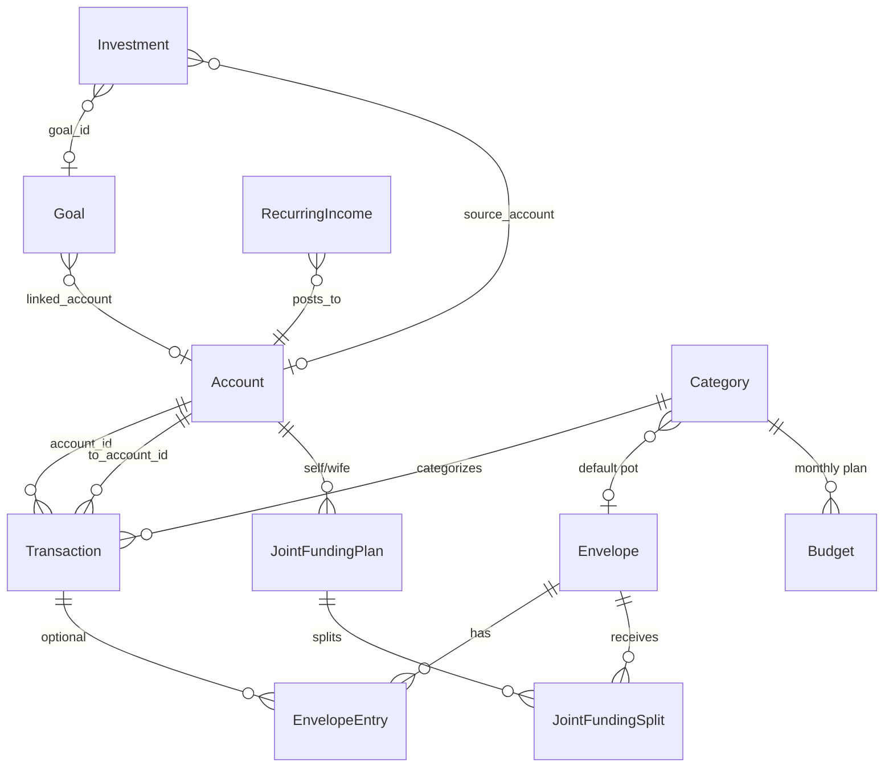

# Finance OS — System Design

Personal finance operating system for household money: ledger-driven accounts, virtual envelopes on Joint cash, an Essentials budget plan, investments, goals, and a monthly ritual.

**Stack:** Flask 3 · SQLAlchemy 2 · SQLite · Jinja2 · Bootstrap 5 · Chart.js · openpyxl · requests (mfapi.in)

**Runtime:** `python app.py` → [http://127.0.0.1:5001](http://127.0.0.1:5001)  
**Day-to-day usage:** [USAGE.md](USAGE.md) · **Product overview:** [README.md](README.md)

---

## 1. Goals and design principles

| Principle | Meaning |
|-----------|---------|
| Ledger-driven | Account balances come from opening balance + transactions. Rebuild from Settings if drift. |
| Cash vs purpose | Real money lives in **Accounts**. **Envelopes** only label purpose of **Joint** cash. |
| Budget ≠ funding | **Budget** is a monthly Essentials plan (~₹1.5L). It does **not** move cash into envelopes. |
| Thin HTTP layer | Blueprints validate/render; **services** own business rules; **models** own persistence. |
| Idempotent month posts | Fund Joint, recurring income, SIPs, EPF use stable description keys so re-post is safe. |
| Local-first | Single SQLite file; backups are file copies; no bank APIs. |

---

## 2. High-level architecture

```
┌─────────────────────────────────────────────────────────────┐
│  Browser (Jinja + Bootstrap + Chart.js)                     │
└────────────────────────────┬────────────────────────────────┘
                             │ HTTP
┌────────────────────────────▼────────────────────────────────┐
│  Flask app factory (app.py)                                 │
│  · config / logging / dirs                                  │
│  · register 12 blueprints                                   │
│  · upgrade_schema() + seed_database()                       │
└──────────────┬─────────────────────────────┬────────────────┘
               │                             │
    ┌──────────▼──────────┐       ┌──────────▼──────────┐
    │  routes/*           │       │  templates/ + static│
    │  (thin controllers) │       └─────────────────────┘
    └──────────┬──────────┘
               │
    ┌──────────▼──────────┐
    │  services/*         │  ← all domain logic
    └──────────┬──────────┘
               │
    ┌──────────▼──────────┐       ┌─────────────────────┐
    │  models/* + db      │──────▶│  database/finance.db │
    └─────────────────────┘       │  backups/*.db       │
                                  └─────────────────────┘
```

### Layer responsibilities

| Layer | Responsibility |
|-------|----------------|
| `app.py` | Factory, blueprint registration, Jinja helpers (`inr`), DB init |
| `config.py` | Env-aware settings (`SECRET_KEY`, DB URI, backup age, currency) |
| `routes/` | Request parsing, flash messages, redirects, template context |
| `services/` | Validation, balance updates, envelope side effects, imports, NAV |
| `models/` | Tables, relationships, simple properties (`signed_amount`, etc.) |
| `utils/seed.py` | Idempotent defaults + one-time migrations |
| `utils/schema.py` | Additive SQLite `ALTER TABLE` upgrades |

### Project layout

```
finance-os/
├── app.py
├── config.py
├── extensions.py          # db = SQLAlchemy()
├── models/
├── routes/
├── services/
├── utils/                 # seed, schema, helpers
├── templates/
├── static/
├── database/              # finance.db, .import_staging/
├── backups/
├── SYSTEM_DESIGN.md       # this document
├── USAGE.md
└── README.md
```

---

## 3. Domain model (product concepts)

### 3.1 Accounts (real cash)

Bank / cash / joint / goal / investment accounts hold **actual balances**.

Typical household:

| Account | Owner | Role |
|---------|-------|------|
| My Account (Suhel) | self | Salary, personal spends, Fund Joint contribution |
| Wife Account (Seema) | wife | Same for spouse |
| Joint Account | joint | Shared household cash; **only** account whose cash is labeled by envelopes |
| Home / Travel / Lifestyle Fund | joint | Goal-linked cash (separate from envelopes) |
| Investment Account | joint | Optional cash staging for investments |
| Cash | joint | Physical cash |
| Salary deduction (non-cash) | — | Used for EPF posts (`skip_cash_impact`) |

`emergency_tagged` on an account is a **virtual earmark** (≤ balance), not a separate account.

### 3.2 Budget vs Envelopes (critical distinction)

```
┌──────────────────────────────┐     ┌──────────────────────────────────┐
│ BUDGET (planning)            │     │ ENVELOPES (Joint purpose labels) │
│ ~₹1.5L Essentials plan       │     │ Essentials / Shopping / Travel / │
│ Rent, groceries, utilities…  │     │ Lifestyle / Unallocated          │
│ Tracks spend vs monthly cap  │     │ Funded by transfers into Joint   │
│ Does NOT move cash           │     │ Debited only on Joint expenses   │
└──────────────────────────────┘     └──────────────────────────────────┘
```

| Topic | Budget | Envelopes |
|-------|--------|-----------|
| Question answered | “Are we over plan for Rent this month?” | “How much Joint cash is for Travel?” |
| Scope | Household Essentials categories | Purpose pots on Joint |
| Dining / movies | **Excluded** from Budget | Fund / spend from **Lifestyle** |
| Parents | **Excluded** from Budget | Usually paid from Suhel/Seema (no pot) |
| Shopping / Travel | Not on Budget | Own pots |
| Pay from Joint | Counts toward Budget if category is on plan | Debits mapped pot |
| Pay from Suhel/Seema | Counts toward Budget if on plan | **No** envelope debit |

**Category slug sets** (`utils/seed.py`):

- `ENVELOPE_PURPOSE_CATEGORY_SLUGS` — shopping, furniture, electronics, travel, bike — envelope-only; stripped from budget rows.
- `BUDGET_EXCLUDED_CATEGORY_SLUGS` — parents, dining-out, dining, movies-entertainment, lifestyle — bookable but outside Essentials Budget; expense create auto-sets `is_excluded_from_budget`.

Household budget categories ≈ seeded `DEFAULT_BUDGET_AMOUNTS` (Rent through Misc / Home Buffer).

### 3.3 Transactions (core ledger)

Types: `expense` · `income` · `transfer` · `investment` · `refund`.

Side effects:

1. Update `Account.current_balance` (unless `skip_cash_impact`).
2. For transfers into Joint: create envelope `allocation` entries (splits or 100% Essentials default).
3. For expenses from Joint: create envelope `spend` entry; set `transaction.envelope_id`.
4. For investment txns: bump holding `invested_amount` / `current_value`; optional unit accrual from NAV.

### 3.4 Joint funding

A **plan** (Settings → Joint funding): Suhel amount + Seema amount + day-of-month + named envelope split lines. Leftover contribution → Unallocated.

**Post month** creates one transfer per person with description  
`Joint funding · {Suhel|Seema} · {Mon YYYY}` (idempotent).  
Editing the plan after post does **not** rewrite history — use **Move between pots** (`reallocate`).

### 3.5 Investments, goals, emergency, net worth

- **Investments** — holdings (MF, SIP, stock, RSU, EPF, FD, NPS, gold, other); optional `scheme_code` for mfapi NAV.
- **Goals** — Emergency, Home, Travel, Car, Retirement, …; `effective_current` prefers linked account / tagged holdings / emergency tags.
- **Emergency fund** — cash tags + investments linked to Emergency goal (no dedicated Emergency bank account).
- **Net worth** — live compute + monthly `NetWorthSnapshot`; liabilities tracked separately.
- **Insurance** — policies with renewal helpers for reminders.
- **Recurring income** — templates posted once per month via checklist / Settings.

---

## 4. Data model

### 4.1 Entity relationship (overview)



### 4.2 Tables

#### `accounts`

| Column | Type | Notes |
|--------|------|-------|
| id | PK | |
| name | string, unique | e.g. My Account, Joint Account |
| account_type | string | cash, salary, bank, joint, emergency, goal, investment |
| owner | string | self, wife, joint |
| opening_balance | Numeric(14,2) | Baseline for rebuild |
| current_balance | Numeric(14,2) | Maintained by services |
| emergency_tagged | Numeric | Virtual EF earmark |
| currency, is_active, sort_order, notes | | |
| created_at, updated_at | | |

#### `transactions`

| Column | Type | Notes |
|--------|------|-------|
| id | PK | |
| date | Date, indexed | |
| amount | Numeric(14,2) | Always > 0 |
| description | string | Idempotency keys for month posts |
| transaction_type | string | expense, income, investment, transfer, refund |
| category_id, subcategory_id | FK → categories | |
| account_id | FK → accounts | Source |
| to_account_id | FK → accounts | Dest for transfers |
| paid_by | string | self, wife, joint |
| payment_mode | string | upi, card, netbanking, cash, auto_debit, cheque, other |
| need_want | string | need, want, n/a |
| notes | text | |
| is_recurring | bool | |
| is_excluded_from_budget | bool | Auto for excluded category slugs |
| envelope_id | FK → envelopes | Pot used for Joint expense |
| investment_id | FK → investments | SIP/EPF installment link |
| skip_cash_impact | bool | True for EPF (salary deduction) |
| created_at, updated_at | | |

**`signed_amount`:** income/refund +, expense/investment −, transfer 0 at household level.

#### `categories`

| Column | Notes |
|--------|-------|
| name, slug (unique) | Hierarchy via `parent_id` |
| category_type | expense, income, investment, transfer, refund |
| envelope_id | Default pot for Joint expenses |
| icon, color, is_system, is_active, sort_order | |

Unique `(name, parent_id)`.

#### `envelopes`

Virtual pots: **Essentials**, **Shopping**, **Travel**, **Lifestyle**, **Unallocated**.

| Column | Notes |
|--------|-------|
| name, slug | unique |
| current_balance | Sum of entries (maintained in service) |
| is_system, is_active, sort_order, icon, color, notes | |

#### `envelope_entries`

| Column | Notes |
|--------|-------|
| envelope_id | FK |
| transaction_id | Nullable for reallocations |
| entry_type | allocation, spend, adjustment, reallocation_in, reallocation_out |
| amount | > 0 |
| notes, created_at | |

**`signed_amount`:** spend / reallocation_out negative; others positive.

#### `budgets`

Unique `(year, month, category_id)`. `amount >= 0`. Actuals computed from non-excluded expenses in that month.

#### `joint_funding_plans` / `joint_funding_splits`

Plan: self/wife account IDs + amounts + `day_of_month` (1–28) + notes + `is_active`.  
Splits: `(plan_id, envelope_id)` unique with amount + sort_order. Leftover → Unallocated at post time.

#### `investments`

Asset types: mutual_fund, sip, stock, rsu, epf, fd, nps, gold, other.  
Owners: self, wife, joint.  
Fields: invested/current amounts, monthly_sip, sip_day, sip_active, source_account_id, scheme_code, units, last_nav, last_nav_date, goal_id, start_date, …

#### `goals`

Types: emergency, home, travel, car, retirement, education, custom.  
`effective_current` rules: emergency → tags + EF investments; else linked account + holdings; else manual `current_amount`.

#### `liabilities`

Types: home_loan, car_loan, personal_loan, credit_card, education_loan, other.  
`outstanding_amount`, `interest_rate`, `owner`.

#### `net_worth_snapshots`

Unique `snapshot_date`. Columns: cash_savings, investments, other_assets, liabilities, net_worth.

#### `insurances`

Policy types + premium frequency; helpers for days-to-renewal / status.

#### `recurring_incomes`

Template: name, amount, account_id, day_of_month, owner. Posted with stable description pattern.

---

## 5. Core flows

### 5.1 Application startup

```
create_app()
  → load Config
  → mkdir database/, backups/
  → db.init_app
  → register blueprints + Jinja filters
  → upgrade_schema()     # create_all + additive ALTERs
  → seed_database()      # idempotent defaults + migrations
```

Seed highlights:

- Rename/migrate legacy account & category names
- Seed accounts, categories, envelopes, category→envelope maps
- Mark budget-excluded transactions; strip envelope-purpose budget rows
- Seed current-month budgets from `DEFAULT_BUDGET_AMOUNTS` if empty
- Seed goals + sample investments if portfolio empty

### 5.2 Monthly ritual (checklist `/month/`)

Recommended order:

1. **Post recurring income** → Suhel / Seema accounts up  
2. **Fund Joint** → transfers with envelope allocations  
3. **Post SIPs** → cash leaves source; holdings updated  
4. **Post EPF** → non-cash investment txn (`skip_cash_impact`)  
5. **Net-worth snapshot** → freeze month totals  

### 5.3 Transaction create (cash + envelopes)

```
create_transaction(...)
  1. _prepare_envelope_side_effects
       · transfer → parse splits; Self/Wife→Joint with no split → 100% Essentials
       · expense from Joint → resolve envelope (explicit → category default → Essentials)
       · expense from personal → no envelope
  2. Soft-warn if expense > pot balance (still allowed; pots may go negative)
  3. Validate cash sufficiency (unless skip_cash_impact)
  4. Persist txn → apply_transaction_to_balances
  5. apply_envelope_entries_for_transaction
  6. Auto-set is_excluded_from_budget for excluded slugs
  7. Commit
```

Update/delete: reverse envelope entries and balances, then re-apply (or delete).

### 5.4 Fund Joint

```
Settings: save plan (amounts + split lines)
         ↓
post_month(year, month)
  for each person in {self, wife} if not already posted:
    prorate plan splits to their contribution (largest-remainder)
    create_transaction(type=transfer, description=idempotent key, splits=...)
         ↓
    Suhel/Seema ↓ · Joint ↑ · envelope allocations ↑
```

### 5.5 Envelope spend vs reallocate

| Action | Bank cash | Envelope balances |
|--------|-----------|-------------------|
| Joint expense | Joint ↓ | Mapped pot ↓ (`spend`) |
| Personal expense | Personal ↓ | Unchanged |
| Transfer into Joint | Source ↓, Joint ↑ | Pots ↑ (`allocation`) |
| **Move between pots** | Unchanged | from ↓ / to ↑ (`reallocation_*`) |

Reallocate is the fix when Fund Joint splits were wrong after money already moved.

### 5.6 Budget month lifecycle

1. Open `/budget/` → `ensure_month_budgets`.  
2. If no positive rows: copy from latest prior month (up to 24 months back).  
3. Actuals = expenses in month with `is_excluded_from_budget=False`.  
4. Status: ok &lt;75%, watch 75–99%, over ≥100%.  
5. UI also surfaces **envelope funding gaps** when category budgets exceed pot funding.  
6. Category detail `/budget/category/<id>` shows month activity.

### 5.7 Excel import

1. Download `/transactions/import/template.xlsx` (live categories + dropdowns).  
2. **Preview:** stage file under `database/.import_staging/{token}.xlsx`; classify ready / duplicate / error.  
3. **Confirm:** import valid rows via `create_transaction`; skip duplicates when enabled; clear staging.

Duplicate key: same date + amount + description.

### 5.8 SIP / EPF

| Kind | Cash | Account |
|------|------|---------|
| SIP (`kind=sip`) | Debits `source_account_id` | Bank / investment |
| EPF (`kind=epf`) | No bank debit | Salary deduction (non-cash) + `skip_cash_impact` |

Idempotent per holding per month. Optional `nav_service.accrue_units_from_purchase` after cash SIP.

### 5.9 Backup / restore / rebuild

| Action | Behavior |
|--------|----------|
| Backup | WAL checkpoint → copy to `backups/finance_os_{stamp}[_label].db` |
| Health | Dashboard nudge if newest backup ≥ `BACKUP_MAX_AGE_DAYS` (default 7) |
| Restore | Safety copy `pre_restore`, overwrite live DB (restart advised) |
| Rebuild balances | Recompute `current_balance` from opening + ledger |
| CSV export | transactions, accounts, networth, investments |

### 5.10 Emergency tags

Accounts → save tags → `emergency_tagged` capped at balance.  
Emergency goal total = effective cash tags + investments with Emergency `goal_id`.

---

## 6. HTTP endpoints

All routes return HTML (server-rendered) unless noted. Prefixes are blueprint `url_prefix`.

### 6.1 Dashboard — `/`

| Method | Path | Handler | Purpose |
|--------|------|---------|---------|
| GET | `/` | `index` | Summary, expense by category, 6-mo trend, health/reminders |

### 6.2 Month checklist — `/month`

| Method | Path | Purpose |
|--------|------|---------|
| GET | `/month/` | Ritual status: income, Fund Joint, SIPs, EPF, NW snapshot |

### 6.3 Transactions — `/transactions`

| Method | Path | Purpose |
|--------|------|---------|
| GET | `/transactions/` | Filtered, paginated ledger |
| GET/POST | `/transactions/new` | Create |
| GET/POST | `/transactions/<id>/edit` | Edit |
| POST | `/transactions/<id>/delete` | Delete (reverse balances/envelopes) |
| GET | `/transactions/import` | Import UI |
| GET | `/transactions/import/template.xlsx` | Download Excel template |
| POST | `/transactions/import` | `action=preview` or `action=confirm` |

### 6.4 Accounts — `/accounts`

| Method | Path | Purpose |
|--------|------|---------|
| GET | `/accounts/` | List + balances |
| POST | `/accounts/emergency-tags` | Save EF cash tags |
| GET/POST | `/accounts/statement-wizard` | Align opening/current to bank as-of |
| GET/POST | `/accounts/new` | Create |
| GET/POST | `/accounts/<id>/edit` | Edit |
| POST | `/accounts/<id>/delete` | Delete per service rules |

### 6.5 Envelopes — `/envelopes`

| Method | Path | Purpose |
|--------|------|---------|
| GET | `/envelopes/` | Overview vs Joint cash |
| POST | `/envelopes/reallocate` | Move labels between pots (no bank move) |
| GET | `/envelopes/<id>` | Month ledger for one pot |

### 6.6 Budget — `/budget`

| Method | Path | Purpose |
|--------|------|---------|
| GET | `/budget/` | Month overview (+ auto carry-forward) |
| GET | `/budget/category/<id>` | Category month activity |
| POST | `/budget/save` | Upsert amounts / renames |
| POST | `/budget/add-row` | Add category to plan |
| POST | `/budget/remove-row` | Remove month line |
| POST | `/budget/copy-previous` | Force copy from prior month |

### 6.7 Reports — `/reports`

| Method | Path | Purpose |
|--------|------|---------|
| GET | `/reports/` | Period summary, charts, comparisons |

### 6.8 Settings — `/settings`

| Method | Path | Purpose |
|--------|------|---------|
| GET | `/settings/` | Hub: stats, backups, recurring, joint, exports |
| POST | `/settings/backup` | Create SQLite backup |
| POST | `/settings/rebuild-balances` | Rebuild account balances |
| POST | `/settings/restore` | Restore from backup |
| GET | `/settings/export/transactions.csv` | CSV |
| GET | `/settings/export/accounts.csv` | CSV |
| GET | `/settings/export/networth.csv` | CSV |
| GET | `/settings/export/investments.csv` | CSV |
| POST | `/settings/recurring-income/post` | Post month income |
| GET/POST | `/settings/recurring-income/new` | Create template |
| GET/POST | `/settings/recurring-income/<id>/edit` | Edit template |
| POST | `/settings/recurring-income/<id>/delete` | Delete template |
| GET/POST | `/settings/joint-funding` | Plan CRUD |
| POST | `/settings/joint-funding/post` | Post month Fund Joint |
| GET | `/settings/categories` | Category list |
| GET/POST | `/settings/categories/new` | Create category |
| GET/POST | `/settings/categories/<id>/edit` | Edit |
| POST | `/settings/categories/<id>/delete` | Delete |

### 6.9 Investments — `/investments`

| Method | Path | Purpose |
|--------|------|---------|
| GET | `/investments/` | Portfolio |
| POST | `/investments/save-holdings` | Bulk value/units update |
| POST | `/investments/refresh-navs` | mfapi NAV refresh |
| GET | `/investments/search-schemes` | JSON scheme search |
| POST | `/investments/post-sips` | Post cash SIPs for month |
| POST | `/investments/post-epf` | Post EPF for month |
| GET/POST | `/investments/new` | Create holding |
| GET/POST | `/investments/<id>/edit` | Edit holding |
| POST | `/investments/<id>/delete` | Delete |

### 6.10 Goals — `/goals`

| Method | Path | Purpose |
|--------|------|---------|
| GET | `/goals/` | List |
| GET | `/goals/<id>` | Detail + ledger |
| GET/POST | `/goals/new` | Create |
| GET/POST | `/goals/<id>/edit` | Edit |
| POST | `/goals/<id>/delete` | Delete |

### 6.11 Net worth — `/networth`

| Method | Path | Purpose |
|--------|------|---------|
| GET | `/networth/` | Live NW + snapshots + liabilities |
| POST | `/networth/snapshot` | Record month snapshot |
| GET/POST | `/networth/liabilities/new` | Create liability |
| GET/POST | `/networth/liabilities/<id>/edit` | Edit |
| POST | `/networth/liabilities/<id>/delete` | Delete |

### 6.12 Insurance — `/insurance`

| Method | Path | Purpose |
|--------|------|---------|
| GET | `/insurance/` | Policy list / overview |
| GET/POST | `/insurance/new` | Create |
| GET/POST | `/insurance/<id>/edit` | Edit |
| POST | `/insurance/<id>/delete` | Delete |

---

## 7. Services layer

| Service | Main responsibilities |
|---------|----------------------|
| `transaction_service` | Create/update/delete; balance apply; running balances; envelope prep |
| `envelope_service` | Overview, ledger, resolve pot, apply/reverse entries, **reallocate**, funding warnings |
| `budget_service` | Ensure/carry-forward month, upsert, category activity, funding gaps, household filter |
| `joint_funding_service` | Plan get/save, month status, post with prorated splits |
| `account_service` | CRUD, rebuild balances, statement wizard |
| `category_service` | Category CRUD |
| `import_service` | Template XLSX, preview stage, confirm import |
| `investment_service` | Portfolio, holdings bulk update, SIP/EPF status + post |
| `nav_service` | mfapi search + latest NAV + unit accrual |
| `emergency_service` | Tags, breakdown, total vs Emergency goal |
| `backup_service` | Backup/restore/health, CSV exports, DB stats |
| `recurring_income_service` | Templates + month post |
| `dashboard_service` | Summary, expense breakdown, trend |
| `health_service` | Weighted financial health score (0–100) |
| `goal_service` | CRUD, overview, detail ledger |
| `net_worth_service` | Live NW, snapshots, liability CRUD |
| `insurance_service` | Policy CRUD + overview |
| `report_service` | Period summary, cashflow, top expenses, comparison |
| `reminder_service` | Insurance renewals, SIPs due, stale backup, etc. |

### Financial health weights

Emergency 20% · Savings 20% · Investment 15% · Debt 15% · Goals 15% · Budget 15%.

---

## 8. Configuration

From `config.py` / `.env`:

| Variable | Default | Purpose |
|----------|---------|---------|
| `FLASK_ENV` | `development` | Development vs Production config |
| `SECRET_KEY` | `dev-finance-os-change-me` | Sessions |
| `DATABASE_URL` | `sqlite:///database/finance.db` | Resolved absolute under project root |
| `CURRENCY_SYMBOL` | `₹` | Display |
| `CURRENCY_CODE` | `INR` | Display |
| `BACKUP_MAX_AGE_DAYS` | `7` | Stale-backup nudge |

Code-only: `ITEMS_PER_PAGE=25`, `BACKUP_DIR`, `DATABASE_DIR`, `IMPORT_STAGING_DIR`, SQLite `check_same_thread=False`.

---

## 9. External integrations

**mfapi.in** only (`services/nav_service.py`):

| Call | Use |
|------|-----|
| `GET /mf/search?q=` | Scheme search (Investments UI) |
| `GET /mf/{code}/latest` | Latest NAV (fallback `/mf/{code}`) |

Timeout 15s · User-Agent `FinanceOS/1.0` · Updates `current_value` via units×NAV or NAV ratio.

No bank aggregators. Excel via openpyxl. Backup = local filesystem copy.

---

## 10. Invariants and edge cases

1. **Joint cash ≈ sum of envelope balances** (allowing temporary overspend warnings). Drift ⇒ over-allocated warning on Envelopes page; fix with spend labeling or reallocate.  
2. **Budget caps never fund pots** — Lifestyle dining requires Fund Joint / reallocate into Lifestyle, not a Budget line.  
3. **Personal expenses never debit envelopes** — even if category maps to a pot.  
4. **EPF does not reduce bank cash** — `skip_cash_impact` + non-cash account.  
5. **Net worth prefers holdings** over Investment Account cash when holdings exist; hides non-cash salary-deduction account.  
6. **Month posts are idempotent** — re-clicking Post is safe.  
7. **Plan edits after Fund Joint** need **Move between pots**, not re-post.  
8. **Schema upgrades are additive** — `upgrade_schema` + seed migrations keep old DBs forward-compatible.

---

## 11. Decision matrix (spend booking)

| Pay from | Category on Essentials Budget? | Envelope effect | Budget actuals |
|----------|--------------------------------|-----------------|----------------|
| Joint | Yes (e.g. Groceries) | Debit Essentials (or mapped pot) | Counts |
| Joint | Dining Out / Movies | Debit Lifestyle | Excluded |
| Joint | Shopping / Travel | Debit Shopping / Travel | Not on Budget |
| Suhel / Seema | Yes (e.g. Medical) | None | Counts |
| Suhel / Seema | Parents | None | Excluded |
| Suhel / Seema | Dining | None | Excluded |

---

## 12. Seeded Essentials budget (reference)

Default monthly amounts (`DEFAULT_BUDGET_AMOUNTS`) — sum ≈ ₹1.35L (user may raise Misc toward ₹1.5L):

| Category | Amount (₹) |
|----------|------------|
| Rent | 43,000 |
| Utilities | 5,000 |
| Groceries | 18,000 |
| Fruits & Vegetables | 8,000 |
| Protein & Supplements | 8,000 |
| Personal Care & Household | 6,000 |
| Cook | 4,000 |
| Fuel & Bike | 5,000 |
| Auto / Cab | 3,000 |
| Gym | 3,000 |
| Insurance | 11,000 |
| Medical | 10,000 |
| Misc / Home Buffer | 11,000 |

Default envelope map (high level): Essentials ← household list above (+ Parents optional labeling); Lifestyle ← Dining Out, Movies & Entertainment; Shopping / Travel ← matching categories; Unallocated ← residual Fund Joint.

---

## 13. Roadmap (from README)

| Sprint | Scope | Status |
|--------|--------|--------|
| 1–4a+++ | Ledger through checklist, import, joint funding, EF tags | Done |
| 4b | Home Planner, Car Planner | Upcoming |
| 5 | FIRE, Buy vs Rent, Tax, AI Insights | Upcoming |

---

## 14. Related docs

| Doc | Audience |
|-----|----------|
| [README.md](README.md) | Setup, feature list, sprint status |
| [USAGE.md](USAGE.md) | How to run the monthly ritual, import, move pots |
| This file | Architecture, data model, endpoints, flows |
